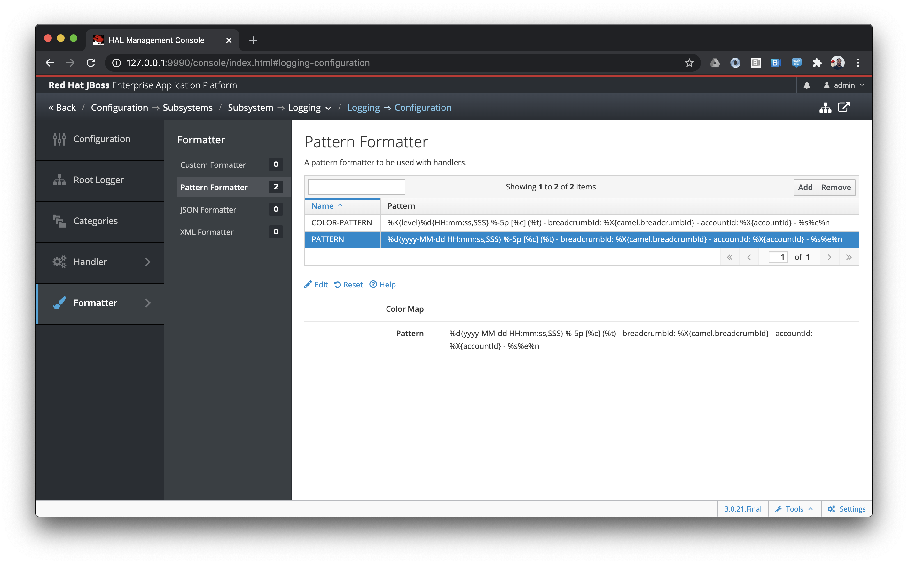

# fuse-7-eap-mdclogging

:white_check_mark: Uses default _JBoss EAP Logging_ framework to log MDC entries.

**Everything works fine after configuring the _JBoss EAP Logging_ formatters**

- _JBoss EAP Logging Pattern Formatter_ screenshot:

- _JBoss EAP_ `server.log`sample:
```
2020-07-11 15:26:57,560 INFO  [org.jboss.modules] (main) - breadcrumbId:  - accountId:  - JBoss Modules version 1.8.9.Final-redhat-00001
2020-07-11 15:26:57,921 INFO  [org.jboss.msc] (main) - breadcrumbId:  - accountId:  - JBoss MSC version 1.4.11.Final-redhat-00001
[...]
2020-07-11 15:27:42,121 INFO  [org.apache.camel.cdi.CdiCamelExtension] (MSC service thread 1-5) - breadcrumbId:  - accountId:  - Camel CDI is starting Camel context [camel-cdi-context]
2020-07-11 15:27:42,127 INFO  [org.apache.camel.impl.DefaultCamelContext] (MSC service thread 1-5) - breadcrumbId:  - accountId:  - Apache Camel 2.21.0.fuse-760027-redhat-00001 (CamelContext: camel-cdi-context) is starting
2020-07-11 15:27:42,129 INFO  [org.apache.camel.impl.DefaultCamelContext] (MSC service thread 1-5) - breadcrumbId:  - accountId:  - StreamCaching is enabled on CamelContext: camel-cdi-context
2020-07-11 15:27:42,129 INFO  [org.apache.camel.impl.DefaultCamelContext] (MSC service thread 1-5) - breadcrumbId:  - accountId:  - MDC logging is enabled on CamelContext: camel-cdi-context
2020-07-11 15:27:42,129 INFO  [org.apache.camel.management.ManagedManagementStrategy] (MSC service thread 1-5) - breadcrumbId:  - accountId:  - JMX is enabled
2020-07-11 15:27:42,209 INFO  [org.wildfly.extension.camel] (MSC service thread 1-5) - breadcrumbId:  - accountId:  - Camel context starting: camel-cdi-context
2020-07-11 15:27:42,209 INFO  [org.wildfly.extension.camel] (MSC service thread 1-4) - breadcrumbId:  - accountId:  - Bound camel naming object: java:jboss/camel/context/camel-cdi-context
2020-07-11 15:27:43,098 INFO  [org.apache.camel.impl.converter.DefaultTypeConverter] (MSC service thread 1-5) - breadcrumbId:  - accountId:  - Type converters loaded (core: 194, classpath: 2781)
2020-07-11 15:27:43,248 INFO  [org.apache.camel.impl.DefaultStreamCachingStrategy] (MSC service thread 1-5) - breadcrumbId:  - accountId:  - StreamCaching in use with spool directory: /var/folders/90/jzwcn8rn46b_mgyhj0pc86xh0000gn/T/camel/camel-tmp-003383a9-a0cb-458c-acc4-fe1d84ec0d42 and rules: [Spool > 128K body size]
2020-07-11 15:27:43,256 INFO  [org.apache.camel.impl.HeadersMapFactoryResolver] (MSC service thread 1-5) - breadcrumbId:  - accountId:  - Detected and using custom HeadersMapFactory: org.apache.camel.component.headersmap.FastHeadersMapFactory@77fc66bd
2020-07-11 15:27:43,316 INFO  [org.apache.camel.impl.DefaultCamelContext] (MSC service thread 1-5) - breadcrumbId:  - accountId:  - Route: scheduled-hello-route started and consuming from: timer://scheduler?fixedRate=true&period=15000
2020-07-11 15:27:43,317 INFO  [org.apache.camel.impl.DefaultCamelContext] (MSC service thread 1-5) - breadcrumbId:  - accountId:  - Total 1 routes, of which 1 are started
2020-07-11 15:27:43,318 INFO  [org.apache.camel.impl.DefaultCamelContext] (MSC service thread 1-5) - breadcrumbId:  - accountId:  - Apache Camel 2.21.0.fuse-760027-redhat-00001 (CamelContext: camel-cdi-context) started in 1.193 seconds
2020-07-11 15:27:43,373 INFO  [org.wildfly.extension.undertow] (ServerService Thread Pool -- 103) - breadcrumbId:  - accountId:  - WFLYUT0021: Registered web context: '/fuse-7-eap-mdclogging' for server 'default-server'
2020-07-11 15:27:43,374 INFO  [org.wildfly.extension.camel] (ServerService Thread Pool -- 103) - breadcrumbId:  - accountId:  - Add Camel endpoint: http://127.0.0.1:8080/fuse-7-eap-mdclogging
2020-07-11 15:27:43,435 INFO  [org.jboss.as.server] (External Management Request Threads -- 1) - breadcrumbId:  - accountId:  - WFLYSRV0010: Deployed "fuse-7-eap-mdclogging.war" (runtime-name : "fuse-7-eap-mdclogging.war")
2020-07-11 15:27:44,358 INFO  [scheduled-hello-route] (Camel (camel-cdi-context) thread #1 - timer://scheduler) - breadcrumbId: ID-jnyilimb-mac-1594474062000-1-1 - accountId: 123456 - Hello from Camel!
2020-07-11 15:27:59,320 INFO  [scheduled-hello-route] (Camel (camel-cdi-context) thread #1 - timer://scheduler) - breadcrumbId: ID-jnyilimb-mac-1594474062000-1-3 - accountId: 123456 - Hello from Camel!
2020-07-11 15:28:14,323 INFO  [scheduled-hello-route] (Camel (camel-cdi-context) thread #1 - timer://scheduler) - breadcrumbId: ID-jnyilimb-mac-1594474062000-1-5 - accountId: 123456 - Hello from Camel!
```